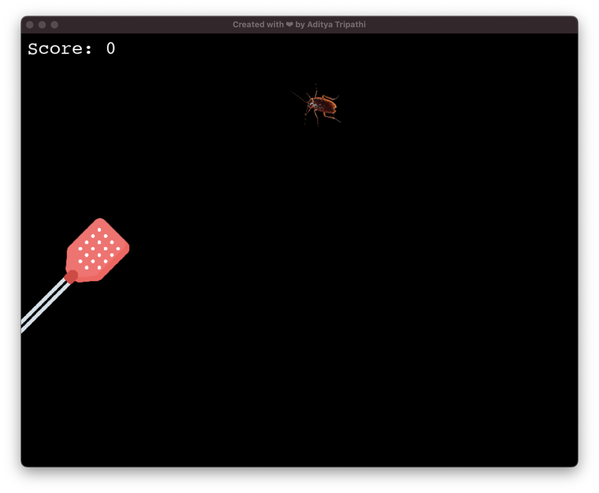

# 🪳 Insect Invasion

A fast-paced, roach-smashing arcade game made with **Pygame**. Your mission? Swat the cockroach before it escapes! The more you splat, the faster they come.

---

## 📸 Screenshot



---

# 🎮 Gameplay

- Control a racket with arrow keys
- Use **spacebar** to strike
- Score a point every time you hit the bug
- Bugs get faster with each level
- Game over if a bug escapes(reaches the edge of the screen)!

---

# 🕹️ Controls

| Key      | Action                  |
| -------- | ----------------------- |
| ↑ / ↓    | Move the racket up/down |
| Spacebar | Strike the bug          |
| Enter    | Select menu options     |

---

# 📦 How to Run

1. Make sure Python3 is installed on your system.
2. Install Pygame using pip:
   ```bash
   pip install pygame
   ```

---

# 🧹 Future Ideas

1. Add sound effects when a bug is swatted
2. Include more types of bugs and power-ups
3. Add a timer or countdown mode
4. Local high score tracking
